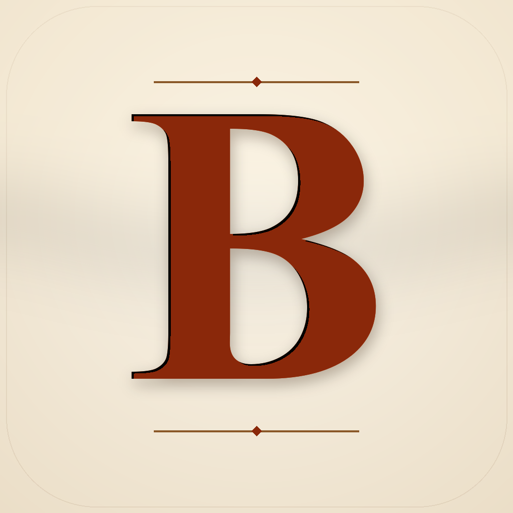
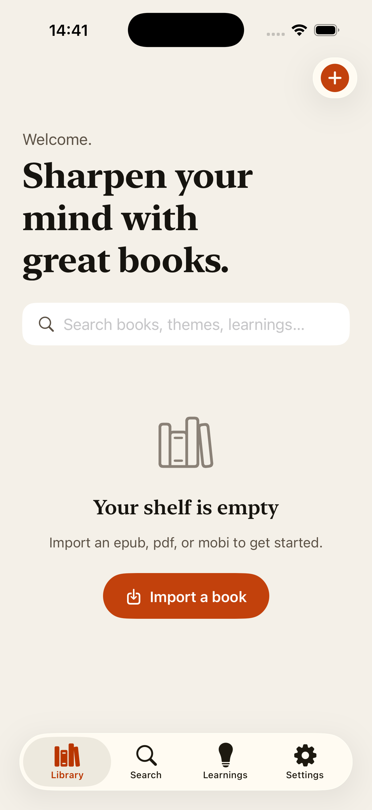

<div align="center">



# BookApp

**Books that bend to your time.**

Compress a 400-page book to 20 pages. Expand 5 pages to 50.
Listen on-device. Speed-read at 1,000 wpm. Re-style any book to read like another.

<sub>iOS · iPadOS · SwiftUI · SwiftData + CloudKit · Apple Foundation Models · Claude</sub>

[Setup](#setup) · [Architecture](docs/architecture.md) · [LLM routing](docs/llm-routing.md) · [Data model](docs/data-model.md) · [Privacy](AppStore/privacy.md)



</div>

---

## What it does

Most reading apps assume you have time for the whole book. BookApp doesn't.

- **Elastic length.** Compress a 400-page treatise into a 20-page summary that keeps the author's voice. Or expand a five-page essay into a chapter. The model preserves tone, structure and key arguments.
- **Listen on-device.** Every book becomes an audiobook with the system's premium voices. The current word lights up as it's spoken; the page flips itself.
- **Speed-read three ways.** Paragraph + word highlighting, single-word focus, or Spritz-style RSVP at any pace from 150 to 1,200 wpm.
- **Re-style.** Make a dense academic chapter sound more like Malcolm Gladwell. Strip references to a theme you don't care about.
- **Pull key learnings.** 5 to 15 takeaways per book in seconds. Edit, star, export.
- **Yours.** Books in your iCloud Drive. Anthropic API key in your Keychain. No backend.

## Setup

```bash
brew install xcodegen
cd /Users/lukadadiani/Documents/book-app
xcodegen generate
open BookApp.xcodeproj
```

In Xcode, set your **Team** under *Signing & Capabilities* and choose a unique
bundle id. Build and run on **iPhone 17 Pro** (or any iOS 18+ simulator).

On first launch:

1. Open *Settings → AI* and paste your Anthropic API key. It's stored in the
   iOS Keychain — never on disk in plain text, never in the project.
2. Tap **Import a book** on the home screen and pick an `.epub` or `.pdf`
   from iCloud Drive.

Get a Claude API key at <https://console.anthropic.com/>.

## Tech

| Layer | Choice |
|---|---|
| UI | SwiftUI on iOS 18+ / iPadOS 18+ |
| Persistence | SwiftData with private CloudKit sync |
| EPUB | In-house parser over `ReadiumZIPFoundation` |
| PDF | PDFKit |
| TTS | `AVSpeechSynthesizer` with word-range highlighting |
| Local LLM | Apple Foundation Models (with MLX-Swift fallback hook) |
| Cloud LLM | Claude Sonnet 4.6 / Opus 4.7 via Anthropic Messages API + ephemeral prompt caching |

See [docs/architecture.md](docs/architecture.md) for the full picture.

## Topics

`ios` · `swiftui` · `ipados` · `swiftdata` · `cloudkit` · `epub-reader` ·
`pdf-reader` · `text-to-speech` · `speed-reading` · `claude-api` ·
`anthropic` · `apple-foundation-models` · `book-summarizer` · `rsvp`

## License

Personal-use license. The transformations of imported books are stored
locally and on your iCloud account; do not redistribute. The app does not
facilitate any public sharing of transformed content.
